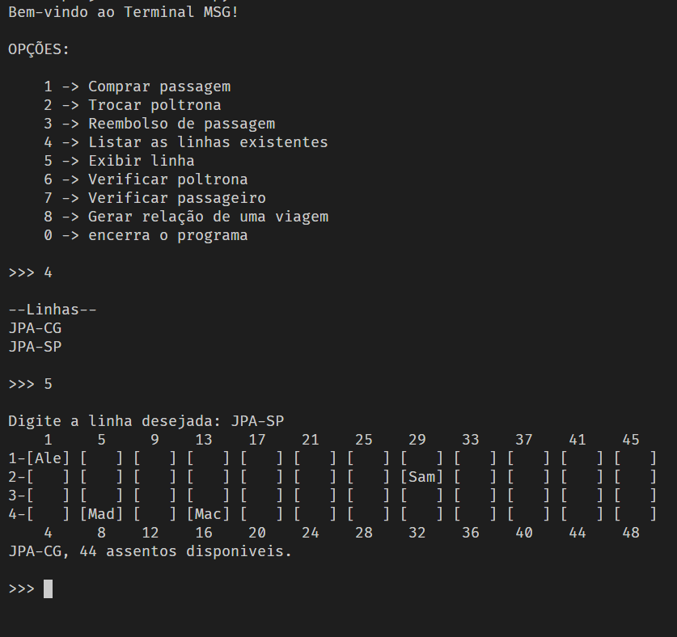

# projeto3-ed
 Segundo projeto realizado na disciplina de Estrutura de Dados envolvendo Programação Orientada a Objetos e Matriz Esparsa.
 
 Integrantes: Gabriel Macaúbas Melo, Maria Eduarda de Almeida Vitorino e Samuel de Morais Lima.

